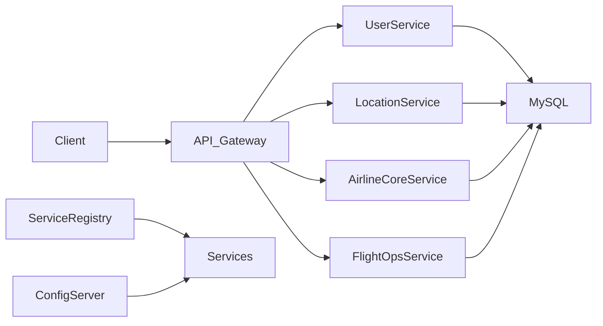

# Airline Microservices Project

A Java-based airline management system built as a multi-module Spring Boot microservices application. The project is organized around reusable domain libraries, cloud infrastructure services, and application-specific business services for user management, location management, airline operations, and flight operations.

## Overview

This repository contains a collection of Spring Boot microservices that together model a flight/airline management platform. The design follows a modular monorepo structure using Maven parent projects and Spring Cloud for service discovery, configuration, and API routing.

The application is organized into three major sections:

- Core shared library: reusable data models, enums, payloads, validation classes, and common utilities
- Cloud infrastructure: service registry, config server, and API gateway
- Business services: user, location, airline-core, and flight operations services

## Tech Stack

- Java 21
- Spring Boot 4.1.0
- Spring Cloud 2025.1.0
- Maven multi-module build
- MySQL
- JPA / Hibernate
- Lombok
- JWT-based authentication for user service
- RESTful API conventions with standardized response wrappers

## Project Structure

```text
Airline/
├── microservices/
│   ├── pom.xml                     # Parent aggregator for the entire microservices project
│   ├── common-lib/
│   │   ├── pom.xml
│   │   └── src/main/java/com/himalayan/
│   │       ├── embeddable/
│   │       ├── enums/
│   │       ├── exception/
│   │       ├── payload/
│   │       └── util/
│   ├── cloud/
│   │   ├── pom.xml
│   │   ├── api-gateway/
│   │   ├── config-server/
│   │   └── service-registry/
│   └── services/
│       ├── pom.xml
│       ├── airline-core-service/
│       ├── flight-ops-service/
│       ├── location-service/
│       └── user-service/
└── README.md
```

## Modules and Responsibilities

### 1. common-lib
Shared library used by all service modules.

Includes:
- shared DTOs and request/response models
- enums used across services
- utility classes
- common exception handling support
- reusable validation and payload structures

### 2. user-service
Handles customer and system-user authentication and user data operations.

Responsibilities:
- signup and login
- JWT token generation and refresh flow
- user profile and account-related APIs
- MySQL-backed persistence for authentication and user data

Service port:
- 5001

Base context path:
- /api/v1

Important configuration:
- `spring.application.name: user-service`
- JWT secret and expiration values configured in `application.yaml`

### 3. location-service
Responsible for geography and airport metadata.

Responsibilities:
- city management
- airport management
- airport lookup by city or ID
- paginated location queries

Service port:
- 5004

Base context path:
- /api/v1

### 4. airline-core-service
Core airline domain service for airline and aircraft definitions.

Responsibilities:
- airline creation and management
- airline status updates
- aircraft management
- owner-based airline queries
- airline dropdown data for UI consumption

Service port:
- 5002

Base context path:
- /api/v1

### 5. flight-ops-service
Flight operations layer for scheduling and flight lifecycle management.

Responsibilities:
- flight creation, update, and deletion
- status transitions
- flight lookup and filtering by airline and airport
- flight operational data and schedule support

Service port:
- 5007

Base context path:
- /api/v1

### 6. cloud modules
The cloud section is designed for infrastructure concerns:

- `service-registry`: Spring Cloud service discovery via Eureka
- `config-server`: central configuration management
- `api-gateway`: request routing and gateway layer for all services

These modules are part of the intended distributed-system architecture and support future deployment and service orchestration.

## Runtime Architecture



## Database Configuration

The services are configured to use MySQL locally.

Current database names used by the project:

- `authentication_db` → user-service
- `airline_location_db` → location-service
- `airlinecore_db` → airline-core-service
- `flight_db` → flight-ops-service

Example database connection pattern:

```yaml
spring:
  datasource:
    url: jdbc:mysql://localhost:3306/<database_name>
    username: root
    password: <your-password>
    driver-class-name: com.mysql.cj.jdbc.Driver
```

> The application currently contains hardcoded local credentials in the YAML files, so you should update them to match your local MySQL environment before running the services.

## Prerequisites

Before running the project, make sure you have:

- Java 21 or newer
- Maven 3.9+
- MySQL installed and running
- A working IDE such as IntelliJ IDEA or VS Code

## Getting Started

### 1. Clone the repository

```bash
git clone <repository-url>
cd Airline
```

### 2. Create MySQL databases

Create the following databases in MySQL:

```sql
CREATE DATABASE authentication_db;
CREATE DATABASE airline_location_db;
CREATE DATABASE airlinecore_db;
CREATE DATABASE flight_db;
```

### 3. Update database credentials

Edit each service's `src/main/resources/application.yaml` file and set your local username/password if needed.

### 4. Build the project

From the `microservices` directory:

```bash
mvn clean install
```

This will build the parent project and all modules.

## Running the Services

Run each service individually in its own terminal:

### User Service

```bash
cd microservices/services/user-service
mvn spring-boot:run
```

### Location Service

```bash
cd microservices/services/location-service
mvn spring-boot:run
```

### Airline Core Service

```bash
cd microservices/services/airline-core-service
mvn spring-boot:run
```

### Flight Ops Service

```bash
cd microservices/services/flight-ops-service
mvn spring-boot:run
```

### Optional infrastructure services

```bash
cd microservices/cloud/service-registry
mvn spring-boot:run

cd ../config-server
mvn spring-boot:run

cd ../api-gateway
mvn spring-boot:run
```

## API Conventions

The services follow a common response format using `ApiResponse` wrappers.

Example response structure:

```json
{
  "statusCode": 200,
  "message": "Airline fetched successfully",
  "data": {},
  "timestamp": "2026-09-27T12:00:00.000+00:00"
}
```

This creates a consistent API contract across all microservices.

## Main API Areas

### User Service Endpoints

- `POST /api/v1/auth/signup`
- `POST /api/v1/auth/login`
- `POST /api/v1/auth/refresh-token`
- `GET /api/v1/users/*`
- `PUT /api/v1/users/*`

### Location Service Endpoints

- `POST /api/v1/airports`
- `GET /api/v1/airports`
- `GET /api/v1/airports/{id}`
- `PUT /api/v1/airports/{id}`
- `DELETE /api/v1/airports/{id}`
- `GET /api/v1/cities`

### Airline Core Service Endpoints

- `POST /api/v1/airlines`
- `GET /api/v1/airlines`
- `GET /api/v1/airlines/{id}`
- `PUT /api/v1/airlines/{id}`
- `PATCH /api/v1/airlines/{id}/status`
- `GET /api/v1/airlines/owner/{ownerId}`

### Flight Ops Service Endpoints

- `POST /api/v1/flights`
- `GET /api/v1/flights`
- `GET /api/v1/flights/{id}`
- `PUT /api/v1/flights/{id}`
- `DELETE /api/v1/flights/{id}`
- `PATCH /api/v1/flights/{id}/status`

## Notes

- This project is a learning and enterprise-style airline microservices example.
- Some cloud infrastructure modules are included as part of the architecture and can be expanded as the project grows.
- Services are heavily built around JPA entities, DTO mapping, and REST controllers.
- The project is intended to be run locally with MySQL before deployment to a cloud or orchestration environment.

## Recommended Next Improvements

- externalize secrets and environment variables
- implement centralized config server configuration
- add service discovery and gateway routing
- add Docker and Kubernetes deployment files
- add integration and unit tests for each service
- add OpenAPI/Swagger documentation
- add CI/CD pipeline automation

## License

This project does not currently specify a license file. If you plan to distribute it publicly, add an appropriate open-source license such as MIT or Apache 2.0.

## Summary

This repository demonstrates a multi-service airline management domain using Spring Boot and Maven. It brings together user management, flight operations, airline management, and location data under a clean modular architecture, making it a strong base for further extension into a full production airline platform.
